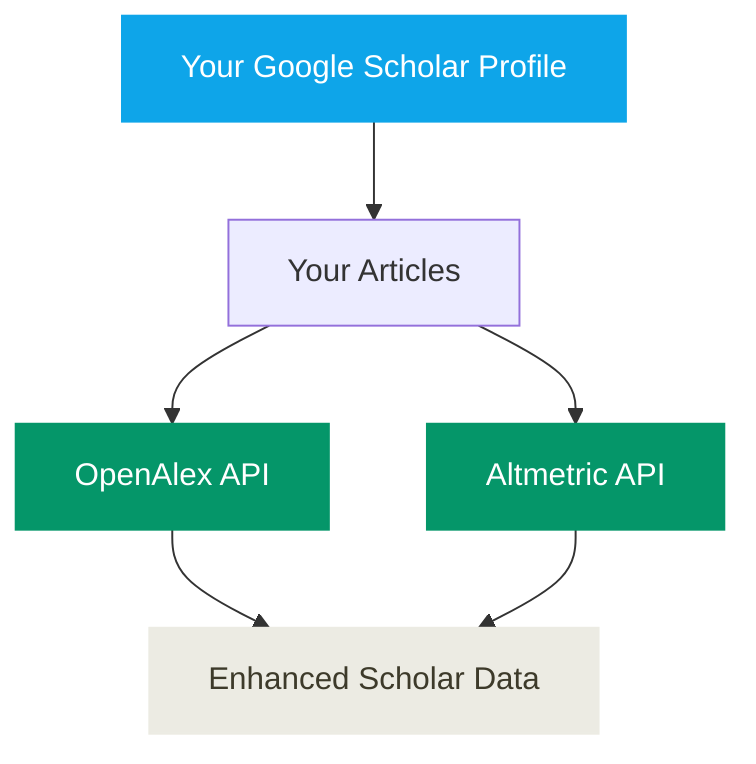
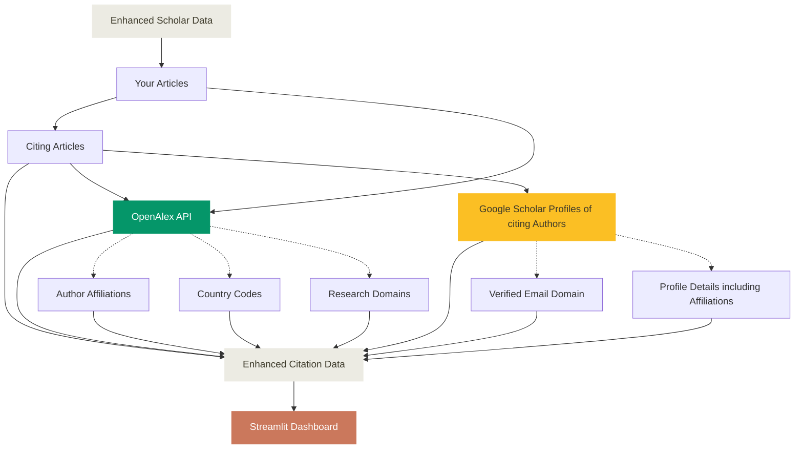

# _ScholarImpact_
A bibliometric tool to analyse, visualise, and share your research impact, output and scholarly influence using Google Scholar and OpenAlex data.

For each article under your Google Scholar Profile, **_ScholarImpact_**: (1) total number of citations, (2) number of unique authors who have cited the article, (3) number of countries from which citations originate, (4) number of institutions from which citations originate, (5) geographic distribution of citations, (6) citation trends over time, (7) research domain analysis, (8) interdisciplinary impact Metrics including Patents and Wikipedia mentions (9) Alternative metrics.


## Workflow Overview
This workflow first extracts author data from your Google Scholar profile and optionally enriches it with OpenAlex and Altmetric data. Then it sources citations for each article under your Google Scholar profile. Next workflow enriches them with information using Google Scholar profiles of citing authors and/or OpenAlex APIs. Finally, output data is used to present your impact of your research with geographic and institutional insights.






## Quick Start

### Prerequisites

Install 
```bash
pip install scholarimpact
```

## Caution
This system is designed for academic research purposes and personal usage. Please use responsibly and in accordance with Google Scholar, OpenAlex, Altmetric terms of services with appropriate attribution.

## Breaking Changes (v0.0.10)

### API Key Requirements
As of version v0.0.10, both OpenAlex and Altmetric now require API keys. This is a breaking change from previous versions.

#### What Changed:

**OpenAlex:**
- **Previous:** Email-based authentication with `--openalex-email` flag
- **Current:** API key-based authentication with `--openalex-api-key` option
- **Impact:** OpenAlex enrichment now requires an API key

**Altmetric:**
- **Previous:** Altmetric worked with just `--use-altmetric` flag (public API)
- **Current:** Altmetric requires API key with `--altmetric-api-key` option
- **Impact:** Altmetric enrichment now requires an explicit API key

## Getting API Keys

### OpenAlex API Key

OpenAlex data is and will remain available at no cost. The API is a freemium service:
- **$1 free credit daily** - sufficient for most research use cases
- **Pay as you go** after daily limit - only charged for usage beyond free tier
- **No API key required** for the free tier (limited rate)
- **Free API key** - create an account in 30 seconds for higher rate limits

**To get your OpenAlex API key:**
1. Go to [openalex.org/settings/api](https://openalex.org/settings/api)
2. Create a free account (takes 30 seconds)
3. Copy your API key from the settings page
4. Use it with the `--openalex-api-key` flag in ScholarImpact commands

**Documentation:** [OpenAlex API Authentication](https://developers.openalex.org/api-reference/authentication)

### Altmetric API Key

Altmetric offers free access for university scientometric researchers through their Details Page API - Counts Only, which is optimized for querying publication identifiers.

**Features:**
- Query by DOI, PMID, or other identifiers
- Returns publication attention metrics (citations, social media mentions, etc.)
- Free access available for university researchers

**To get Altmetric API key:**
1. Visit [Altmetric Research Access](https://www.altmetric.com/our-audience/researchers/research-access/)
2. Complete the researcher access request form
3. Specify your institution and research project
4. Altmetric will provide your API key
5. Use it with the `--altmetric-api-key` flag in ScholarImpact commands

**Documentation:** [Altmetric Details Page API - Counts Only](https://help.altmetric.com/en/articles/9806465)

**Note:** Free university researcher access is available through the research access program. Contact Altmetric for details on eligibility and access.

## Step-by-Step Guide

### Option 1: For Deployment (Recommended)

This approach creates a standalone project suitable for deployment to Streamlit Cloud or local development.

#### Step 1: Generate Dashboard Project

```bash
# Generate a dashboard project
scholarimpact generate-dashboard --output-dir my-research-dashboard --name app.py

# Navigate to the generated folder
cd my-research-dashboard
```

This creates a complete project structure with `app.py`, `requirements.txt`, `.streamlit/config.toml`, and a `static` folder containing fonts used by default theme.

#### Step 2: Extract Author Publications

```bash
# Extract your publications from Google Scholar
scholarimpact extract-author "YOUR_SCHOLAR_USER_ID"

# With OpenAlex API key (required for OpenAlex enrichment and Altmetric)
scholarimpact extract-author "YOUR_SCHOLAR_USER_ID" --openalex-api-key YOUR_API_KEY

# Or use full URL
scholarimpact extract-author "https://scholar.google.com/citations?user=YOUR_SCHOLAR_USER_ID" --openalex-api-key YOUR_API_KEY
```

This creates `data/author.json` with your publication list. Add `--openalex-api-key` to enrich with OpenAlex and Altmetric metrics (API key required).

#### Step 3: Crawl Citation Data

```bash
# Crawl citations with OpenAlex enrichment (API key required)
scholarimpact crawl-citations data/author.json --openalex-api-key YOUR_API_KEY
```

This creates `data/cites-{ID}.json` files for each publication.

#### Step 4: Test Locally

```bash
# Run the dashboard locally
streamlit run app.py

# Or alternatively
python app.py
```

Open `http://localhost:8501`to view your dashboard.

#### Step 5: Push your changes to a Github Repository

```bash
# Initialize git repository
git init
git add .
git commit -m "Initial research dashboard"

# Create GitHub repository and push
git remote add origin https://github.com/YOUR_USERNAME/YOUR_REPO.git
git branch -M main
git push -u origin main
```

#### Step 6: Deploy on Streamlit Cloud

1. Go to [share.streamlit.io](https://share.streamlit.io)
2. Click "New app"
3. Connect your GitHub account
4. Select your repository and branch
5. Set main file path: `app.py` (or your custom name)
6. Click "Deploy"

#### Step 7: Project Structure for Deployment

Your repository should contain:
```
my-research-dashboard/
├── app.py                    # Main dashboard file
├── requirements.txt          # Python dependencies
├── Dockerfile                # Docker container configuration
├── docker-compose.yml        # Docker Compose orchestration (optional)
├── .streamlit/
│   └── config.toml          # Streamlit configuration
├── static/                  # Static assets (fonts from scholarimpact/assets/fonts)
│   ├── SpaceGrotesk-SemiBold.ttf
│   ├── SpaceGrotesk-VariableFont_wght.ttf
│   ├── SpaceMono-Regular.ttf
│   ├── SpaceMono-Bold.ttf
│   ├── SpaceMono-Italic.ttf
│   ├── SpaceMono-BoldItalic.ttf
│   └── OFL-*.txt           # Font licenses
└── data/
    ├── author.json          # Author profile data
    └── cites-*.json         # Citation data files
```

#### Step 8: Docker Deployment (Alternative to Streamlit Cloud)

The generated project includes `Dockerfile` and `docker-compose.yml` for containerized deployment:

**Using Docker Compose (Recommended):**
```bash
# Build and run with Docker Compose
docker-compose up -d

# View logs
docker-compose logs -f

# Stop the service
docker-compose down
```

**Using Docker directly:**
```bash
# Build the image
docker build -t scholarimpact-dashboard .

# Run the container
docker run -p 8501:8501 scholarimpact-dashboard

# Or run in background
docker run -d -p 8501:8501 scholarimpact-dashboard
```

Access your dashboard at `http://localhost:8501`

#### Step 9: Update Data

To update citation data:

1. Re-run step-2 and step-3 to update data files
2. Commit changes and push them to your GitHub repository
3. For Streamlit Cloud: automatic restart on push
4. For Docker: rebuild and redeploy the container

#### Tips for Streamlit Cloud Deployment

- Keep data files under 100MB each for optimal performance
- Use `.gitignore` to exclude unnecessary files
- Set secrets in Streamlit Cloud settings if needed
- Monitor app logs in Streamlit Cloud dashboard for debugging

#### Tips for Docker Deployment

- Resource limits are configured in `docker-compose.yml` (1 CPU, 512MB RAM)
- Use environment variables for configuration (see `docker-compose.yml`)
- For production, update the `x-ports` section with your domain
- Mount data volume for persistent storage: `docker run -v ./data:/app/data -p 8501:8501 scholarimpact-dashboard`

### Option 2: For Quick Local Testing

This approach is fastest for local analysis without deployment needs.

#### Step 1: Extract Author Publications

```bash
# Extract publications directly
scholarimpact extract-author "YOUR_SCHOLAR_USER_ID"
```

#### Step 2: Crawl Citation Data

```bash
# Crawl citations with OpenAlex enrichment (API key required)
scholarimpact crawl-citations data/author.json --openalex-api-key YOUR_API_KEY
```

#### Step 3: Launch Dashboard

```bash
# Run dashboard directly
ScholarImpact
```

The dashboard opens at `http://localhost:8501`.

## CLI Options Reference

### `scholarimpact extract-author` Command

Extract author publications from Google Scholar with OpenAlex and Altmetric enrichment:

```bash
scholarimpact extract-author [OPTIONS] SCHOLAR_ID
```

Arguments:
- `SCHOLAR_ID`: Google Scholar author ID or full profile URL

Options:
| Option | Type | Default | Description |
|--------|------|---------|-------------|
| `--max-papers N` | int | None | Maximum number of papers to analyze (default: all) |
| `--delay X` | float | 2.0 | Delay between requests in seconds |
| `--output-dir DIR` | str | ./data | Output directory for author.json |
| `--output-file FILE` | str | None | Custom output file path (overrides output-dir) |
| `--openalex-api-key KEY` | str | None | API key for OpenAlex (enables OpenAlex enrichment) |
| `--altmetric-api-key KEY` | str | None | API key for Altmetric (enables Altmetric enrichment) |

OpenAlex enrichment adds (all fields prefixed with `openalex_`):
- `openalex_ids`: Object containing all identifiers:
  - `openalex`: OpenAlex work URL
  - `doi`: Digital Object Identifier URL
  - `mag`: Microsoft Academic Graph ID
  - `pmid`: PubMed ID URL
- `openalex_type`: Publication type (article, book, etc.)
- `openalex_citation_normalized_percentile`: Percentile ranking of citations
- `openalex_cited_by_percentile_year`: Citation percentile by year
- `openalex_fwci`: Field-Weighted Citation Impact
- `openalex_cited_by_count`: OpenAlex citation count
- `openalex_primary_topic`: Main research topic
- `openalex_domain`, `openalex_field`, `openalex_subfield`: Hierarchical classification

Altmetric enrichment adds (all fields prefixed with `altmetric_`):
- `altmetric_score`: Overall Altmetric attention score
- `altmetric_cited_by_wikipedia_count`: Citations in Wikipedia
- `altmetric_cited_by_patents_count`: Citations in patents
- `altmetric_cited_by_accounts_count`: Social media accounts mentioning
- `altmetric_cited_by_posts_count`: Social media posts mentioning
- `altmetric_scopus_subjects`: Scopus subject classifications
- `altmetric_readers`: Reader counts by platform (Mendeley, CiteULike, etc.)
- `altmetric_readers_count`: Total reader count
- `altmetric_images`: Altmetric badge images (small, medium, large)
- `altmetric_details_url`: Link to detailed Altmetric page

Examples:
```bash
# Basic usage (Google Scholar only, no enrichment)
scholarimpact extract-author "ABC123DEF"

# With OpenAlex API key for enrichment
scholarimpact extract-author "ABC123DEF" --openalex-api-key YOUR_OPENALEX_KEY

# With both OpenAlex and Altmetric enrichment
scholarimpact extract-author "ABC123DEF" --openalex-api-key YOUR_OPENALEX_KEY --altmetric-api-key YOUR_ALTMETRIC_KEY

# Limit to first 20 papers with 3-second delays
scholarimpact extract-author "ABC123DEF" --openalex-api-key YOUR_OPENALEX_KEY --max-papers 20 --delay 3

# Custom output file with OpenAlex API key
scholarimpact extract-author "ABC123DEF" --output-file data/my_author.json --openalex-api-key YOUR_OPENALEX_KEY

# Full URL format
scholarimpact extract-author "https://scholar.google.com/citations?user=ABC123DEF" --openalex-api-key YOUR_OPENALEX_KEY
```

### `scholarimpact crawl-citations` Command

Crawl citations with OpenAlex integration:

```bash
scholarimpact crawl-citations [OPTIONS] AUTHOR_JSON
```

Arguments:
- `AUTHOR_JSON`: Path to author.json file containing publications

Options:
| Option | Type | Default | Description |
|--------|------|---------|-------------|
| `--openalex-api-key KEY` | str | None | API key for OpenAlex (required to use OpenAlex) |
| `--max-citations N` | int | None | Maximum citations per paper |
| `--delay-min X` | float | 5.0 | Minimum delay between requests (seconds) |
| `--delay-max Y` | float | 10.0 | Maximum delay between requests (seconds) |
| `--output-dir DIR` | str | None | Output directory (defaults to author.json directory) |

Examples:
```bash
# Basic usage with OpenAlex API key (required)
scholarimpact crawl-citations data/author.json --openalex-api-key YOUR_API_KEY

# Custom delays
scholarimpact crawl-citations data/author.json --openalex-api-key YOUR_API_KEY --delay-min 3 --delay-max 8

# Custom output directory
scholarimpact crawl-citations data/author.json --openalex-api-key YOUR_API_KEY --output-dir custom_data

# Limit citations per paper
scholarimpact crawl-citations data/author.json --openalex-api-key YOUR_API_KEY --max-citations 100
```

### `ScholarImpact` Command

Launch the interactive dashboard:

```bash
ScholarImpact [OPTIONS]
```

Options:
| Option | Type | Default | Description |
|--------|------|---------|-------------|
| `--port N` | int | 8501 | Port to run the dashboard on |
| `--address ADDR` | str | localhost | Address to bind the server to |
| `--data-dir DIR` | str | ./data | Directory containing citation data files |

Examples:
```bash
# Basic usage
ScholarImpact

# Custom port
ScholarImpact --port 8502

# External access
ScholarImpact --address 0.0.0.0

# Different data directory
ScholarImpact --data-dir custom_data
```

### `scholarimpact quick-start` Command

Complete analysis pipeline from Scholar ID to dashboard:

```bash
scholarimpact quick-start [OPTIONS] SCHOLAR_ID
```

Arguments:
- `SCHOLAR_ID`: Google Scholar author ID or full profile URL

Options:
| Option | Type | Default | Description |
|--------|------|---------|-------------|
| `--openalex-api-key KEY` | str | None | OpenAlex API key (enables OpenAlex enrichment) |
| `--altmetric-api-key KEY` | str | None | Altmetric API key (enables Altmetric enrichment) |
| `--output-dir DIR` | str | ./data | Output directory for all data |
| `--launch-dashboard/--no-dashboard` | flag | True | Launch dashboard after analysis |

Examples:
```bash
# Complete pipeline with OpenAlex enrichment
scholarimpact quick-start "ABC123DEF" --openalex-api-key YOUR_OPENALEX_KEY

# Complete pipeline with both OpenAlex and Altmetric enrichment
scholarimpact quick-start "ABC123DEF" --openalex-api-key YOUR_OPENALEX_KEY --altmetric-api-key YOUR_ALTMETRIC_KEY

# Skip dashboard launch
scholarimpact quick-start "ABC123DEF" --no-dashboard

# Custom output directory with enrichment
scholarimpact quick-start "ABC123DEF" --output-dir results --openalex-api-key YOUR_OPENALEX_KEY
```

### `scholarimpact generate-dashboard` Command

Generate a standalone dashboard project for deployment to Streamlit Cloud or Docker:

```bash
scholarimpact generate-dashboard [OPTIONS]
```

Options:
| Option | Type | Default | Description |
|--------|------|---------|-------------|
| `--output-dir DIR` | str | . | Output directory for generated files |
| `--name FILE` | str | my_dashboard.py | Name of the dashboard file |
| `--data-dir DIR` | str | ./data | Data directory path for dashboard |
| `--title TEXT` | str | My Citation Dashboard | Dashboard title |

Examples:
```bash
# Generate dashboard in current directory
scholarimpact generate-dashboard

# Custom output directory and title
scholarimpact generate-dashboard --output-dir my-project --title "Research Impact Analysis"

# Custom data directory location
scholarimpact generate-dashboard --data-dir ../citation_data --name app.py
```

This command generates:

- A dashboard Python file (default: `my_dashboard.py`)
- `Dockerfile` for containerization (Python 3.13-slim base)
- `docker-compose.yml` for orchestration with resource limits
- `.streamlit/config.toml` with theme configuration
- `requirements.txt` for dependencies
- `static` folder containing fonts used by default theme

The generated project is ready for deployment to:
- **Streamlit Cloud**: Push to GitHub and deploy via share.streamlit.io
- **Docker**: Build and run locally or on any Docker-compatible server
- **Docker Compose**: Orchestrate with resource limits and environment configuration

## Citation

[](https://doi.org/10.5281/zenodo.17282708)

If you use ScholarImpact in your research, please cite it as:

```bibtex
@software{tiwari_2025_17282762,
  author       = {Tiwari, Abhishek},
  title        = {ScholarImpact: A Python tool to analyse, visualise, and share individual research impact, output and scholarly influence using bibliometric data},
  month        = oct,
  year         = 2025,
  publisher    = {Zenodo},
  doi          = {10.5281/zenodo.17282708},
  url          = {https://doi.org/10.5281/zenodo.17282708},
}
```

**APA Format:**
```
Tiwari, A. (2025). ScholarImpact: A Python tool to analyse, visualise, and share individual research impact, output and scholarly influence using bibliometric data. Zenodo. https://doi.org/10.5281/zenodo.17282708
```

**MLA Format:**
```
Tiwari, A. ScholarImpact: A Python tool to analyse, visualise, and share individual research impact, output and scholarly influence using bibliometric data. Zenodo, 7 Oct. 2025, https://doi.org/10.5281/zenodo.17282708.
```
